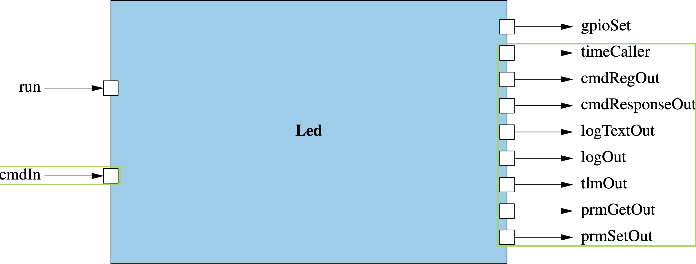

# LED Blinker: Component Design and Initial Implementation

The purpose of this exercise is to walk you through the creation and initial implementation of an F´ component to control the blinking of an LED. This section will discuss the design of the full component, the implementation of a command to start/stop the LED blinking, and the sending of events.  Users will then proceed to the initial ground testing before finishing the implementation in a later section.

## Component Design

In order for our component to blink an LED, it needs to accept a command to turn on the LED and drive a GPIO pin via a port call to the GPIO driver. It will also need a [rate group](https://nasa.github.io/fprime/UsersGuide/best/rate-group.html) input port to control the timing of the blink. Additionally, we will define events and telemetry channels to report component state, and a parameter to control the period of the blink.

This component design is captured in the block diagram below with input ports on the left and output ports on the right. Ports for standard F´ functions (e.g. commands, events, telemetry, and parameters) are circled in green.



In this exercise, the `BLINKING_ON_OFF` command shall toggle the blinking state of the LED. The period of the blinking is controlled by the `BLINK_INTERVAL` parameter. Blinking is implemented on the `run` rate group input port. The component also defines several telemetry channels and events describing the various actions taken by the component.

### Design Summary

**Component Ports:**
1. `run`: invoked at a set rate from the rate group, used to control the LED blinking
2. `gpioSet`: invoked by the `Led` component to control the GPIO driver

> Standard component ports (circled in green) are not listed here.

**Commands:**
1. `BLINKING_ON_OFF`: turn the LED blinking on/off

**Events:**
1. `SetBlinkingState`: emitted when the component sets the blink state
2. `BlinkIntervalSet`: emitted when the component blink interval parameter is set
3. `LedState`: emitted when the LED is driven to a new state

**Telemetry Channels:**
1. `BlinkingState`: state of the LED blinking
2. `LedTransitions`: count of the LED transitions

**Parameters:**
1. `BLINK_INTERVAL`: LED blink period in number of rate group calls

## Create the component

It is time to create the basic component. In a terminal, navigate to the project's root directory and run the following:

```bash
# In led-blinker
cd Components

fprime-util new --component
```
You will be prompted for information regarding your component. Fill out the prompts as shown below:

```bash
[INFO] Cookiecutter source: using builtin
  [1/8] Component name (MyComponent): Led
  [2/8] Component short description (Component for F Prime FSW framework.): Component to blink an LED driven by a rate group
  [3/8] Component namespace (Components): Components
  [4/8] Select component kind
    1 - active
    2 - passive
    3 - queued
    Choose from [1/2/3] (1): 1
  [5/8] Enable Commands?
    1 - yes
    2 - no
    Choose from [1/2] (1): 1
  [6/8] Enable Telemetry?
    1 - yes
    2 - no
    Choose from [1/2] (1): 1
  [7/8] Enable Events?
    1 - yes
    2 - no
    Choose from [1/2] (1): 1
  [8/8] Enable Parameters?
    1 - yes
    2 - no
    Choose from [1/2] (1): 1
[INFO] Found CMake file at 'led-blinker/Components/CMakeLists.txt'
Add Led to led-blinker/Components/CMakeLists.txt at end of file? (yes/no) [yes]: yes
Generate implementation files? (yes/no) [yes]: yes
Refreshing cache and generating implementation files...
[INFO] Created new component and generated initial implementations.
```
Your new component is located in the directory `led-blinker/Components/Led`.

### Commands

Commands are used to command the component from the ground system or a command sequencer. We will add a command named `BLINKING_ON_OFF` to turn on or off the blinking LED. This command will take in an argument named `on_off` of type `Fw.On`.


Inside your `led-blinker/Components/Led` directory, open the file `Led.fpp` and search for the following:

```
        # One async command/port is required for active components
        # This should be overridden by the developers with a useful command/port
        @ TODO
        async command TODO opcode 0
```

Replace that block with the following:

```
        @ Command to turn on or off the blinking LED
        async command BLINKING_ON_OFF(
            on_off: Fw.On @< Indicates whether the blinking should be on or off
        )
```

Save the file, exit the text editor, and run the following in the `led-blinker/Components/Led` directory:

```bash
# In led-blinker/Components/Led
fprime-util impl
```

This command will auto generate two files: `Led.template.hpp` and `Led.template.cpp`. These files contain the stub implementation for the component. These should now include stubs for this newly added command.

Inside your `led-blinker/Components/Led` directory, open `Led.template.hpp` and copy the following block of code. Paste it in replacement of the `TODO_cmdHandler` block in `Led.hpp`.

```cpp
      //! Implementation for BLINKING_ON_OFF command handler
      //! Command to turn on or off the blinking LED
      void BLINKING_ON_OFF_cmdHandler(
          const FwOpcodeType opCode, //!< The opcode
          const U32 cmdSeq, //!< The command sequence number
          Fw::On on_off //!< Indicates whether the blinking should be on or off
      ) override;
```

Inside your `led-blinker/Components/Led` directory, open `Led.template.cpp` and copy the following block of code and paste it into `Led.cpp` replacing the `TODO_cmdHandler` block.

```cpp
  void Led ::
    BLINKING_ON_OFF_cmdHandler(
        const FwOpcodeType opCode,
        const U32 cmdSeq,
        Fw::On on_off
    )
  {
    // TODO
    this->cmdResponse_out(opCode,cmdSeq,Fw::CmdResponse::OK);
  }
```

> This pattern of copying implementations from \*.template.\* files into our cpp and hpp files will be repeated throughout the rest of this tutorial.

Save the file, exit the text editor, and run the following in the `led-blinker/Components/Led` directory to verify your component is building correctly.

```bash
# In led-blinker/Components/Led
fprime-util build
```

## Component State

Many of the behaviors of the component discussed in the [Component Design](#component-design) section require the tracking of some state. Before diving into the implementation of the behavior let us set up and initialize that state.

Open `Led.hpp` in `led-blinker/Components/Led`. Add the following private member variables to the end of the file just before the two closing `}` of the class definition and namespace.

```cpp
    Fw::On m_state; //! Keeps track if LED is on or off
    U64 m_transitions; //! The number of on/off transitions that have occurred from FSW boot up
    U32 m_count; //! Keeps track of how many ticks the LED has been on for
    bool m_blinking; //! Flag: if true then LED blinking will occur else no blinking will happen
```

Open `Led.cpp` in `led-blinker/Components/Led`, and initialize your member variables in the constructor:

```cpp
Led ::Led(const char* const compName) : LedComponentBase(compName),
    m_state(Fw::On::OFF),
    m_transitions(0),
    m_count(0),
    m_blinking(false)
{}
```

Save the file, exit the text editor, and run the following in the `led-blinker/Components/Led` directory to verify your component is building correctly.

```bash
# In led-blinker/Components/Led
fprime-util build
```

Now that the member variables are set up, we can continue into the component implementation.

## Command Implementation

Now we will implement the behavior of the `BLINKING_ON_OFF` command. An initial implementation is shown below and may be copied into `Led.cpp` in-place of the stub we just copied in.

```cpp
  void Led ::
    BLINKING_ON_OFF_cmdHandler(
        const FwOpcodeType opCode,
        const U32 cmdSeq,
        Fw::On on_off
    )
  {
    this->m_count = 0; // Reset count on any successful command
    this->m_blinking = Fw::On::ON == on_off; // Update blinking state

    // TODO: Add an event that reports the state we set to blinking.
    // NOTE: This event will be added during the "Events" exercise.

    // TODO: Report the blinking state via a telemetry channel.
    // NOTE: This telemetry channel will be added during the "Telemetry" exercise.

    // Provide command response
    this->cmdResponse_out(opCode,cmdSeq,Fw::CmdResponse::OK);
  }
```
Save the file then run the following command in the terminal to verify your component is building correctly.

```bash
# In led-blinker/Components/Led
fprime-util build
```

> Fix any errors that occur before proceeding with the rest of the tutorial.

## Events

Events represent a log of system activities. Events are typically emitted any time the system takes an action. Events are also emitted to report off-nominal conditions. Our component has three events, one that this section will show and two are left to the student.

Back inside your `led-blinker/Components/Led` directory, open the `Led.fpp` file. After the command you added in the previous section, add this event:

```
        @ Reports the state we set to blinking.
        event SetBlinkingState(state: Fw.On) \
            severity activity high \
            format "Set blinking state to {}."
```

Save the file and in the terminal, run the following to verify your component is building correctly.

```bash
# In led-blinker/Components/Led
fprime-util build
```
> Resolve any errors before continuing.

Now open `Led.cpp` in your `led-blinker/Components/Led` directory and navigate to the `BLINKING_ON_OFF` command. Report, via our new event, the blinking state has been set.

To do so, replace:
```cpp
      // TODO: Add an event that reports the state we set to blinking.
      // NOTE: This event will be added during the "Events" exercise.
```

with:
```cpp
      this->log_ACTIVITY_HI_SetBlinkingState(on_off);
```

Save the file and in the terminal, run the following to verify your component is building correctly.

```bash
fprime-util build
```

> Resolve any `fprime-util build` errors before continuing

## Try it yourself

Below is a table with tasks you should complete. These tasks require you to go back into the component's files and add the missing lines.

| Task | Missing lines |
|-------|-------------|
| 1. Add an event named `BlinkIntervalSet` to the fpp. The event takes an argument of `U32` type to indicate the set interval. | `event BlinkIntervalSet(interval: U32) severity activity high format "LED blink interval set to {}"` |
| 2. Add an event named `LedState` to the fpp. The event takes an argument of `Fw.On` type to indicate the LED has been driven to a different state. | `event LedState(on_off: Fw.On) severity activity low format "LED is {}"` |

Save all files and in the terminal, run the following to verify your component is building correctly.

```bash
# In led-blinker/Components/Led
fprime-util build
```

> Resolve any `fprime-util build` errors before continuing

## Conclusion

Congratulations!  You have now implemented some basic functionality in a new F´ component. Before finishing the implementation, let's take a break and try running the above command through the ground system. This will require integrating the component into the system topology, which we will get into in the next section.

### Next Step: [Initial Component Integration](./initial-integration.md).
